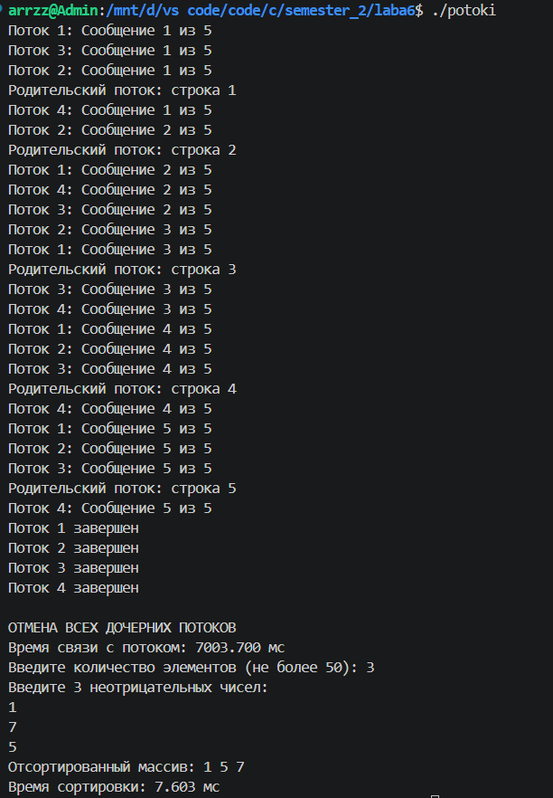

# Отчет по практическому заданию №6: Знакомство с POSIX потоками

## Выполненные задания на оценку 3

Код реализует:

1. **Создание и управление потоками (pthread_create, pthread_join)**

2. **Передачу параметров в потоки через структуры**

3. **Обработку завершения потоков (pthread_cancel, pthread_cleanup_push/pop**

4. **Реализацию алгоритма Sleepsort**

# Задание 1: Создание потока
## Реализация:

```c
pthread_t thread[4]; // Массив для 4 потоков
    info thread_info_data[4]; // Данные для каждого потока

    // Инициализируем данные для 4 потоков (ID от 1 до 4, по 5 сообщений)
    for (int i = 0; i < 4; i++) {
        thread_info_data[i].thread_id = i + 1;
        thread_info_data[i].message_count = 5;
    }

    // Создаем 4 дочерних потока
    for (int i = 0; i < 4; i++) {
        if (pthread_create(&thread[i], NULL, thread_func, &thread_info_data[i]) != 0) {
            perror("Ошибка при создании потока");
            return 1;
        }
    }
```
### Описание:

* Создано 4 потока с помощью pthread_create()

* Каждый поток получает уникальные параметры через структуру thread_inf

* Родительский и дочерние потоки выводят по 5 строк текста

# Задание 2: Ожидание потока
## Реализация:
```c
    for (int i = 0; i < 4; i++) {
        pthread_join(thread[i], NULL);
    }
```
### Описание:
* Использован pthread_join() для ожидания завершения дочерних потоков

# Задание 3: Параметры потока
## Реализация:
```c
struct thread_inf {
    int thread_id;
    int message_count;
};
// Инициализируем данные для 4 потоков (ID от 1 до 4, по 5 сообщений)
    for (int i = 0; i < 4; i++) {
        thread_info_data[i].thread_id = i + 1;
        thread_info_data[i].message_count = 5;
    }
```
* Создано 4 потока, исполняющих одну и ту же функцию
* Каждый поток получает свой уникальный ID (1,2,3,4)
* Каждый поток выводит 5 сообщений

# Задание 4: Завершение нити без ожидания
## Реализация:
```c
// В функции потока - задержка между сообщениями
sleep(1);

// В основном потоке - отмена через 2 секунды
sleep(2);
printf("\nОТМЕНА ВСЕХ ДОЧЕРНИХ ПОТОКОВ\n");
for (int i = 0; i < 4; i++) {
    pthread_cancel(thread[i]);
}
```
* Добавлен sleep(1) в функцию потока между выводами строк
* Через 2 секунды после создания дочерних потоков основной поток прерывает их работу с помощью pthread_cancel()

# Задание 5: Обработка завершения потока
## Реализация:
```c
void thread_cleanup(void *arg) {
    info* data = (info*)arg;
    printf("Поток %d: завершение работы\n", data->thread_id);
}

void* thread_func(void* arg) {
    pthread_cleanup_push(thread_cleanup, arg);
    // ... код потока ...
    pthread_cleanup_pop(0);
    return NULL;
}
```
* Использован pthread_cleanup_push() для регистрации функции очистки
* При отмене потока вызывается thread_cleanup(), выводящая сообщение о завершении

# Задание 6: Sleepsort
## Реализация:
```c
void* sleep_sort(void* arg) {
    int value = *(int*)arg;
    usleep(value * 1000);
    printf("%d ", value);
    fflush(stdout);
    return NULL;
}

void sleep_run() {
    int arr[MAX_SIZE];
    int n;
    pthread_t threads[MAX_SIZE];
    
    printf("Введите количество элементов (не более %d): ", MAX_SIZE);
    scanf("%d", &n);
    
    for (int i = 0; i < n; i++) {
        scanf("%d", &arr[i]);
    }
    
    for (int i = 0; i < n; i++) {
        pthread_create(&threads[i], NULL, sleep_sort, &arr[i]);
    }
    
    for (int i = 0; i < n; i++) {
        pthread_join(threads[i], NULL);
    }
}
```
* Каждый элемент массива обрабатывается в отдельном потоке
* Поток засыпает на время, пропорциональное значению элемента
* После пробуждения выводит число (массив сортируется по возрастанию)

***ВЫВОД***: 
* Создание 4 потоков с разными параметрами
* Ожидание завершения потоков через pthread_join
* Принудительную отмену потоков через pthread_cancel
* Обработку завершения через pthread_cleanup_push/pop
* Алгоритм Sleepsort для сортировки массива

**ДЕМОНСТРАЦИЯ РАБОТЫ:**




